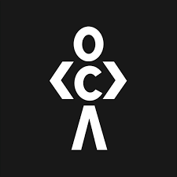
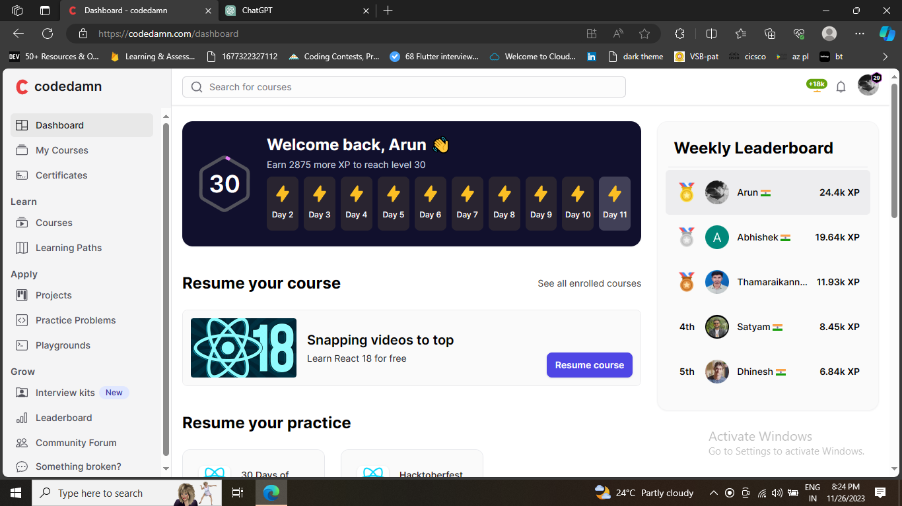

<!---->
<!--  -->

<h1 align="center">
  
</h1>

  

<h4 align="center"><code><a href="https://arun.engineer" title="Portfolio" > 👑Portfolio👑</a> </code></h4>

<h4 align="center">
  <code><a href="https://www.linkedin.com/in/arun-l-ba488022a/" title="LinkedIn Profile"> LinkedIn </a></code>
  <code><a href="https://leetcode.com/arunarunarun7354/" title="LeetCode Profile"> LeetCode </a></code>
   <code><a href="https://codedamn.com/user/arun100203" title="Codedamn"> Codedamn </a></code>
   <code><a href="https://auth.geeksforgeeks.org/user/arunarunarun7354/" title="Geeks for Geeks Profile"> Geeks for Geeks </a></code>
     <code><a href="https://www.hackerrank.com/profile/arunarunarun7354" title="Hacker Rank"> Hacker Rank </a></code>
     
</h4>

  Hi, I'm Arun, A Flutter Developer from India
   
   
  🎓 I'm currently pursuing B.E(CSE) in V.S.B. Engineering College, Karur.
   
  💻 I love creating Wondering things using Flutter, .
   
  📫 My Portfolio: <a href="https://arun.engineer/">Feel Free To Contact Me</a> 

<h2 align="center">🔥 Languages & Frameworks & Tools & Abilities 🔥</h2>
 
<h2 align="center">

<code></code>
<code></code>
<code></code>
<code></code>
<code></code>
<code></code>
<code></code>

<code></code>
<code></code>
<code></code>
<code></code>
<code></code>
<code></code> 

<code></code>
<code></code>
<code></code>
<code></code>
<code></code>
<code></code>
<code></code>

 
</h2>

<h2 align="center">⚡ Stats ⚡</h2>
 

  

    
    
  

           
  

    
  

   
  
  <!--  -->
  
  
  

  
## 🏆GitHub Trophies

 

### ✍️Random Dev Quote

  

    
<h2> 💥Achievements of 2023 💖 </h2> 

    
    
    
    
  

  

<!--

<h2 align="center">👨‍💻 Repositories 👨‍💻</h2>
 

  
  

      

  
  

      

  
  

      
-->

